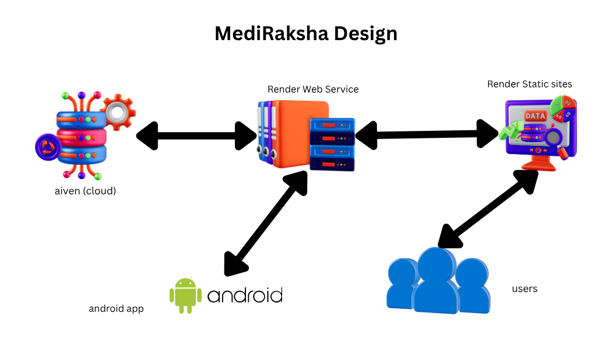

# 🏥 Mediraksha

  
  
  
  
  

---

## 🚀 Overview

**Mediraksha** is an advanced, comprehensive healthcare ecosystem designed to bridge the gap between patients and medical solutions. By leveraging modern technology and AI, Mediraksha simplifies healthcare management, appointment scheduling, and instant medical consultations.

### ✨ Key Features

*   🔍 **Hospital Finder:** Locate nearby healthcare facilities effortlessly.
*   🤖 **AI Consultation:** Instant, intelligent preliminary medical guidance.
*   📊 **Hospital Resource Tracker:** Real-time visibility into available medical resources.
*   📖 **Disease Information Hub:** A comprehensive knowledge base for symptoms and conditions.
*   📁 **Report Management:** Securely upload and store your medical reports.
*   📅 **Smart Booking:** Seamlessly book hospital appointments online.
*   🩺 **Connect with Doctors:** Get in touch with specialized healthcare professionals.

---

## 🏗️ Architecture & Pipeline

  

---

## 🐳 Containerization & Deployment

Mediraksha is fully containerized using Docker to ensure seamless deployment across development and production environments.

*   🌐 **/frontend/Dockerfile** – Multi-stage build powered by **Nginx** for high-performance static serving.
*   ⚙️ **/backend/Dockerfile** – Optimized **Node.js** environment for fast, asynchronous API processing.
*   📦 **compose.yaml** – Multi-container orchestration to spin up the entire ecosystem with a single command (`docker compose up`).

---

## 📸 Application Highlights:

🔑 <b>Sign Up / Authentication</b>

🏠 <b>User Dashboard / Home</b>

🛠️ <b>Healthcare Services Portal</b>

---

## 🔗 Quick Links & Resources

| Resource | Link |
| :--- | :--- |
| 🗄️ **Database Schema Design** | [View DBdiagram.io 📊](https://dbdiagram.io/d/Mediraksha-69a16c88a3f0aa31e14af24b) |
| 🔌 **API Architecture Board** | [View Miro Board 🗺️](https://miro.com/app/board/uXjVG3Ywa2M=/?share_link_id=206279430295) |

---

## 🛠️ Tech Stack

Mediraksha is built using modern, reliable, and high-performance technologies:

*   **Frontend UI:** `React.js` (v18+) with `TypeScript` for type safety and robust components.
*   **Backend API:** `Node.js` with `Express.js` implementing secure RESTful APIs.
*   **Database layer:** Cloud-hosted `PostgreSQL` for reliable, relational, and ACID-compliant data storage.

---

  <b>Crafted with ❤️ by Team Mediraksha</b>

