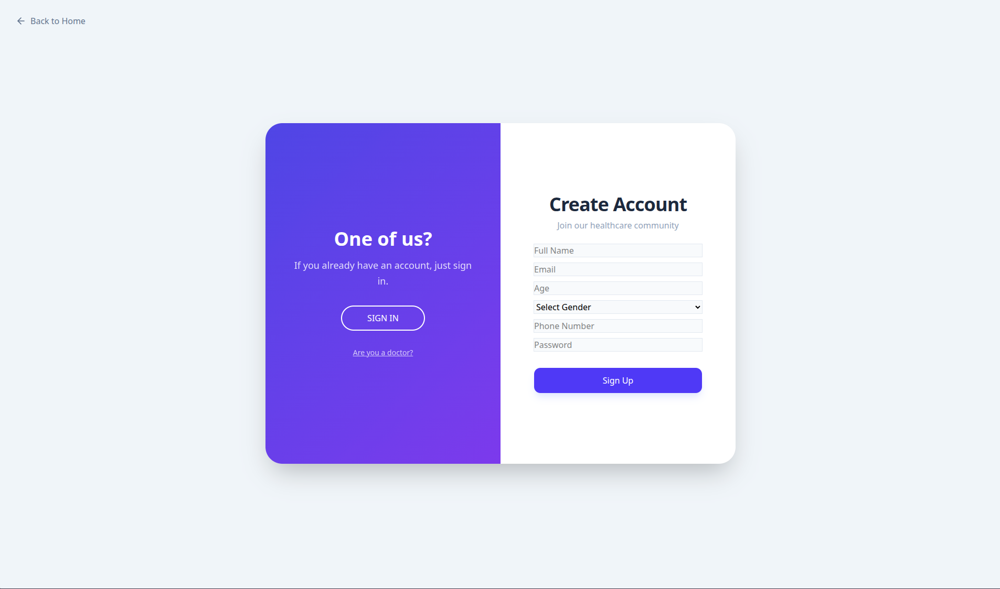
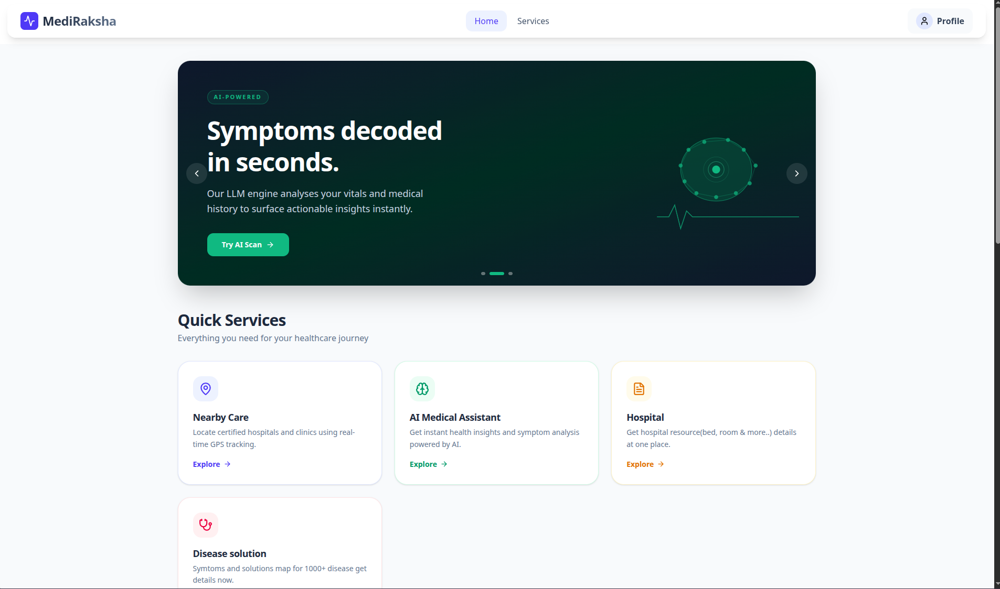
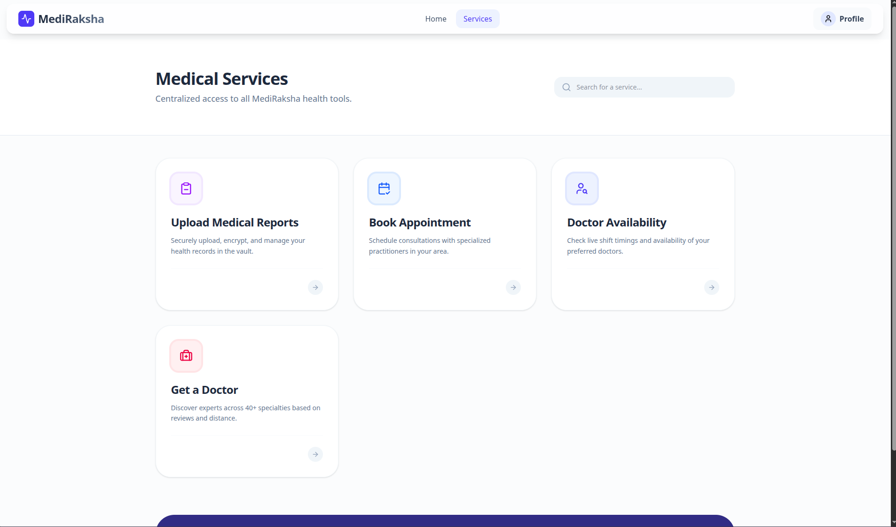

# Mediraksha
A healthcare application having features to assist people for medication 
1. Finding hospital
2. AI consult
3. Hospital resource
4. Disease info
5. Upload report
6. Book appointment
7. Get a doctor

---

## Pipeline Diagram:

---

## Dockerfile
dockerfile to create and manage the container of the application  
1. /frontend/Dockerfile nginx based  
2. /backend/Dockerfile nodejs layer  
3. compose.yaml to combined services  

---

## Test Snapshot:

Sign up

Home

Services

---

## Quick Links
**APP:** https://mediraksha2-0-1.onrender.com/  
**DB-design:** https://dbdiagram.io/d/Mediraksha-69a16c88a3f0aa31e14af24b  
**API-design:** https://miro.com/app/board/uXjVG3Ywa2M=/?share_link_id=206279430295  

---

## Technical stack
**Frontend:** React + Typescript  
**Backend:** Nodejs + Express  
**Database:** Postgres cloud  

---

## By Team Mediraksha
